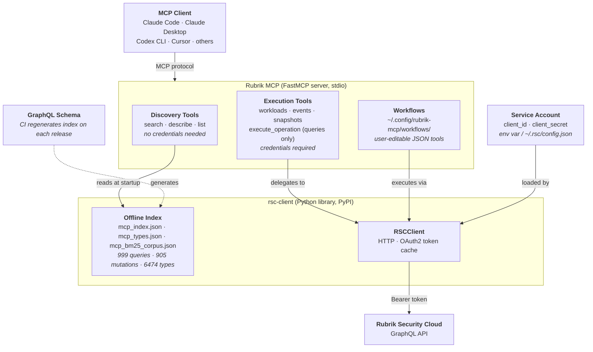

# Advanced reference

This document covers the full built-in tools table, architecture, community workflows, and development setup. For installation and getting started, see the [README](../README.md).

---

## Built-in tools

### Discovery (no credentials needed)

These tools work entirely offline using a pre-built index of the RSC schema. No network, no auth required.

| Tool | Description |
|------|-------------|
| `rsc_search_schema` | Find the right query or mutation by keyword, field meaning, or type vocabulary in one call |
| `rsc_describe_operation_full` | Operation signature with all input/enum types expanded inline |
| `rsc_describe_type` | Fields/values for a GraphQL type |

### Execution (credentials required)

| Tool | Description |
|------|-------------|
| `rsc_execute_operation` | Run any raw GraphQL query (mutations are not supported — Claude generates Python code instead) |
| `rsc_get_workloads` | List workloads with protection, compliance, usage, and backup status |
| `rsc_get_events` | Get recent events and activity, always scoped to a time window |
| `rsc_get_clusters` | List Rubrik clusters registered in RSC, with status, version, capacity, and runway |
| `rsc_get_sla_domains` | List SLA Domains with base frequency, retention lock, archival, and replication settings |
| `rsc_search_help` | Search KB articles, product documentation, and known issues by keyword |
| `rsc_take_on_demand_snapshot` | Trigger an on-demand backup for a workload |
| `rsc_wait_for_job` | Poll a backup job until it completes |
| `rsc_assign_sla` | Assign an SLA domain to one or more workloads |
| `rsc_onboard_host` | Register a host so Rubrik can protect workloads running on it |

### Community workflow examples

Workflows are plain JSON files installed by dropping them into `~/.config/rubrik-mcp/workflows/` and restarting the MCP client. Examples from the [rubrik-community](https://github.com/rubrikinc/rubrik-community) repository include:

| Workflow | Description |
|----------|-------------|
| `rsc_threat_triage_for_workload` | Anomaly detection, threat monitoring, sensitive data exposure, and quarantine list for a workload |
| `rsc_fileset_partial_success_detail` | Detailed reasons for fileset PARTIAL_SUCCESS backup events |

### Workflow management

| Tool | Description |
|------|-------------|
| `rsc_save_workflow` | Save a multi-step workflow as a named, callable MCP tool |
| `rsc_list_workflows` | List all workflows in `~/.config/rubrik-mcp/workflows/` |
| `rsc_delete_workflow` | Remove a saved workflow |

---

## Architecture



- **Discovery tools** are fully offline — they read pre-generated JSON indexes that ship with `rsc-client`; no network, no auth
- **Execution tools** instantiate `RSCClient`, which loads credentials, obtains an OAuth2 token, and fires the GraphQL request
- **Workflows** are JSON specs that chain tool calls; the engine resolves `${step.field}` references between steps
- **rsc-client** keeps the schema index current — CI regenerates it from the SDL on each Rubrik release

The server entry point is `src/rubrik/server.py`. Workflow files are plain JSON stored in `~/.config/rubrik-mcp/workflows/` and auto-registered as tools on startup.

---

## Gating policy

Optional local allow/deny policy that bounds what the MCP will do, independent of the service account's RSC permissions (RBAC decides what the account *can* do; this decides what the MCP is *willing* to expose). Read from `~/.config/rubrik-mcp/mcp-policy.json` at startup; a secure-default template is seeded on first run (`0600`). Changes take effect on the next server start.

**Relocating the config directory (`RUBRIK_MCP_CONFIG_DIR`).** Both the policy file and the `workflows/` directory live under `~/.config/rubrik-mcp` by default. Set the `RUBRIK_MCP_CONFIG_DIR` environment variable to point them elsewhere — e.g. `RUBRIK_MCP_CONFIG_DIR=/config` makes the server read/seed `/config/mcp-policy.json` and `/config/workflows/`. This is primarily for containers: mount a single volume and set `RUBRIK_MCP_CONFIG_DIR` to it, and the server auto-seeds the policy there on first run regardless of the image's home directory. See [docs/docker.md](docker.md).

The default location is fixed at `~/.config/rubrik-mcp` on every OS (on Windows, under your user profile); `RUBRIK_MCP_CONFIG_DIR` is the only way to change it. The audit log, `mcp-audit.log` (JSON lines, one per tool call, rotated at 10 MB), is written to the same directory.

**Upgrading from `~/.rubrik`.** Earlier versions kept the policy and workflows in `~/.rubrik`. Nothing is migrated automatically and nothing under `~/.rubrik` is read, changed or deleted. If `~/.rubrik/mcp-policy.json` exists and no policy exists yet at the new location, the server prints a one-time notice to stderr (and records it in the audit log) on startup. By then the server has already created a default policy and an empty `workflows/` directory at the new location, so the commands below overwrite the default policy; they work the same whether run before or after the first start of the new version. Stop the server, then:

```bash
mkdir -p ~/.config/rubrik-mcp/workflows
mv ~/.rubrik/mcp-policy.json ~/.config/rubrik-mcp/
mv ~/.rubrik/workflows/* ~/.config/rubrik-mcp/workflows/
```

On Windows PowerShell:

```powershell
New-Item -ItemType Directory -Force $HOME\.config\rubrik-mcp\workflows
Move-Item -Force $HOME\.rubrik\mcp-policy.json $HOME\.config\rubrik-mcp\
Move-Item -Force $HOME\.rubrik\workflows\* $HOME\.config\rubrik-mcp\workflows\
```

(Skip the workflow commands if you have no `~/.rubrik/workflows` directory.) If you run the server in a container, update the volume mount to the new path (see [docs/docker.md](docker.md)).

**Write tools are disabled by default.** Out of the box `writes_enabled` is `false`, so no write tool is registered and the agent cannot see one. Enabling them is a deliberate step: set `writes_enabled` to `true` and restart the server.

This is the template seeded on first run — every write tool is listed so you can see the full set and toggle each `true`/`false`:

```json
{
  "writes_enabled": false,
  "write_tools": {
    "rsc_take_on_demand_snapshot": true,
    "rsc_assign_sla": true,
    "rsc_onboard_host": true
  },
  "queries": { "allow_by_default": true, "allowed": [], "denied": [] },
  "cross_mcp_egress": { "allowed": [] }
}
```

Note that the per-tool entries are `true` while `writes_enabled` is `false`: the master switch wins, so nothing is exposed until you flip it. The per-tool map then decides which of the write tools you get.

`write_tools` is a **sparse override map**, so you don't *have* to keep every tool listed — any tool you omit stays enabled once `writes_enabled` is `true`. For example, `"write_tools": { "rsc_assign_sla": false }` disables only that one and leaves the rest on. The seeded file enumerates all of them purely for discoverability.

| Key | Effect |
| :-- | :-- |
| `writes_enabled` | Master switch, **default `false`**. While `false`, all write tools are hidden from the agent regardless of `write_tools`. |
| `write_tools.<name>` | Per-tool on/off, applied only when `writes_enabled` is `true` (omitted = enabled). |
| `queries.denied` | Read operation names to block, e.g. `"o365Teams"`. |
| `queries.allow_by_default` / `allowed` | Set `false` + list `allowed` for strict allowlist mode. |
| `cross_mcp_egress.allowed` | Allowlist of non-Rubrik MCP destinations a workflow may send data to. Empty = none. |

Precedence for reads: `denied` > `allowed` > `allow_by_default`. Cross-MCP egress is allowlist-only (no default-allow).

List items are JSON strings — **double-quoted and comma-separated**: `["o365Teams", "o365Mailboxes"]`. Invalid JSON makes the server refuse to start (fail-closed) and print the parse error; it never falls back to permissive.

This is a startup configuration control, not a tamper-proof boundary — for a hard limit, use a least-privilege service account.

---

## Update check

Each rubrik-mcp release bundles a schema index built from one RSC version, and RSC tenants upgrade on a rolling schedule. At startup the server compares the index date with the connected tenant's `deploymentVersion`:

- **In sync, or the index is newer than the tenant:** no notice. If a call fails because an operation or field doesn't exist yet on the tenant, the response includes an `index_note` explaining that.
- **The index is older than the tenant:** the server asks PyPI which releases exist and picks the newest one built for the tenant's RSC version or earlier. Releases built for a newer RSC version than the tenant runs are never suggested. If a matching release exists, the server adds an update notice, including the exact command for your install method, to the instructions your MCP client receives, so your assistant can tell you. Discovery tools also add an `index_note` when a lookup misses.

The PyPI response is cached for 24 hours in `update-check.json` in the config directory. If PyPI can't be reached, the server uses the cached answer or skips the check. Set `RUBRIK_MCP_NO_UPDATE_CHECK=1` to turn off the PyPI lookup. The comparison with the tenant still runs.

After updating, restart your MCP client. The running server can't replace itself.

---

## Community workflows

Additional workflows contributed by the community — threat feed management, SLA operations, compliance reporting, and more — are available in the [rubrik-community](https://github.com/rubrikinc/rubrik-community) repository.

To install a community workflow, copy the JSON file into `~/.config/rubrik-mcp/workflows/` and restart your MCP client.

To contribute a workflow you've built, open a pull request in the community repo. Add the JSON file to `workflows/` and update the README table. No code changes required — just the JSON spec.

---

## Development setup

```bash
git clone https://github.com/rubrikinc/rubrik-mcp.git
cd rubrik
python3 -m venv .venv && source .venv/bin/activate
pip install -e .
```

To develop against a local `rsc-client` checkout instead of PyPI:

```bash
git clone https://github.com/rubrikinc/rubrik-security-cloud-python-graphql-client.git
pip install -e ../rubrik-security-cloud-python-graphql-client
```

The server runs in stdio mode (for MCP clients):

```bash
rubrik-mcp
```

The offline schema index is loaded at startup from `rsc-client`'s `mcp_index.json` and `mcp_types.json`. If the RSC schema changes, update the Python client's indexes first, then restart the server.
